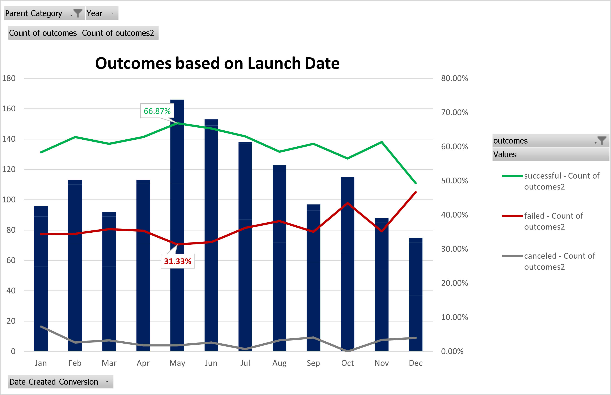

# Kickstarting with Excel - An Analysis of Kickstarter Campaigns
- - -
## Overview of Project
Our friend Louise needs to raise $10,000 for the performance she is organizing, *Fever*.  In this Module, we were tasked with sorting through a relatively large data set which included informaiton about past kickstarter campaigns in the hopes of revealing trends that would help Louise determine if her monetary goal is reasonable and establish when during the year she should launch her campaign to optimize her efforts.
- - -
### Purpose
While completing this module students were introduced to some of the automated features that Excel has to offer such as:
 - formatting cells,
 - Sorting and filtering mass amounts of data,
 - Creating new sheets within a workbook,
 - Using formulas to perform calculations using data spanning multiple sheets,
 - Creating easily manipulated pivot tables,
 - Generating visually appealing charts to display our data quickly to the user.

In addition to the functions of Excel, students were introduced to commonly used statistical methods such as; the mean, median, mode, and quartiles, to help our client, Louise, determine what an appropriate goal would be for her fundraiser based on the success of failures of others.  After reviewing our initial data, Louise's kickstarter campaign began and she quickly approached her goal, but now she wants to see how her campaign measures up to similar fundraisers!

- - -
## Analysis and Challenges
To generate this analysis the first thing we needed to do was create an easily manipulated pivot table.  In our pivot table we included the number of successful, failed, and canceled kickstarter projects and filtered the results to only include those related to theater productions.  We also sorted this data to display which months of the year had the most campaigns in each of the aforementioned categories.  For this analysis we can clearly see that the greatest number of successful campaigns happen during the month of May.  However, it is important to note that May also appears to be the most popular month for campaigns to be launched.  So, it might be interesting to take this one step further and look at the *percentage* of successful campaigns launched in each month. [See source file](kickstarter_challenge_COPY.zip).
- - - 
### Results:  Outcomes Based on Launch Date

---
For this analysis we can clearly see that the greatest number of successful campaigns happen during the month of May.  However, it is important to note that May also appears to be the most popular month for campaigns to be launched.  So, it might be interesting to take this one step further and look at the *percentage* of successful campaigns launched in each month. [See source file](kickstarter_challenge_COPY.zip).

From this additional graph we can confirm that historically, 66% of all of our theater related kickstarter campaigns launched during the month of May were successful and this was greater than any other month during the year.  May also had the lowest fail rate!  This graph was created by simply adjusting the "outcomes" in the field category to a "% of the row total".

- - -
### Results Outcomes Based on Goals
Insert written analysis here

- - -
### Challenges and Difficulties Encountered
Insert stuff here

- - -
## Results
Two conclusions based on outcomes based on launch date
conclusion based on goals
Limitations of the dataset
Possible tables and/or graphs that we could create moving forward
